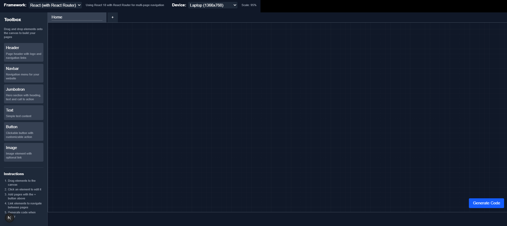

# Website Builder

A drag-and-drop website builder that helps you design and generate code for web applications across multiple frameworks.

## Overview

Website Builder is a powerful visual development tool that allows you to design websites through an intuitive drag-and-drop interface. Once your design is complete, you can generate all the necessary code files for your project in your chosen framework.


## Features

- **Visual Drag-and-Drop Interface**: Design your website without writing code
- **Multi-Page Support**: Create and manage multiple pages for your website
- **Component Library**: Pre-built components including headers, navbars, jumbotrons, text blocks, buttons, and images
- **Framework Selection**: Generate code for different frameworks (React fully supported, Angular and Vue coming soon)
- **Code Generation**: Download a complete, ready-to-run project with all necessary files
- **Property Customization**: Fine-tune the appearance and behavior of each component
- **Page Navigation**: Link components to navigate between pages

## Supported Frameworks

- **React**: Full support with React Router for multi-page applications (development in progress)
- **Angular**: Limited support (coming soon)
- **Vue**: Limited support (coming soon)

## Getting Started

### Prerequisites

- Node.js 18.0.0 or higher
- npm or yarn

### Installation

1. Clone the repository:
```bash
git clone https://github.com/AjinND/website-builder.git
cd website-builder
```

2. Install dependencies:
```bash
npm install
# or
yarn install
```

3. Start the development server:
```bash
npm run dev
# or
yarn dev
```

4. Open [http://localhost:3000](http://localhost:3000) in your browser to see the application.

## How to Use

1. **Select a Framework**: Choose your target framework (React, Angular, or Vue)
2. **Choose a Device Size**: Select the device size to design for (Desktop, Laptop, Tablet, Mobile)
3. **Build Your Pages**:
   - Drag elements from the toolbox onto the canvas
   - Click on elements to edit their properties in the style editor
   - Add multiple pages using the + button in the page tabs
   - Set up navigation between pages
4. **Generate Code**: Click the "Generate Code" button to download a zip file with all your project files
5. **Run Your Project**: Extract the zip file and follow the instructions in the generated README to run your project locally

## Working with Components

### Available Components

- **Header**: Page header with logo and navigation links
- **Navbar**: Navigation menu for your website
- **Jumbotron**: Hero section with heading, text, and call to action
- **Text**: Simple text content blocks
- **Button**: Clickable buttons with customizable actions
- **Image**: Image elements with optional links

### Editing Components

1. Click on any component on the canvas to select it
2. Use the style editor panel to modify its properties:
   - Change text content, colors, and font styles
   - Set up links to other pages or external URLs
   - Customize component-specific properties
   - (more features to be added)

## Generated Project Structure

When you generate code for a React project, you'll receive a zip file with the following structure:

```
my-react-app/
├── package.json
├── postcss.config.js
├── tailwind.config.js
├── public/
│   └── index.html
└── src/
    ├── App.js
    ├── AppRouter.js
    ├── index.js
    ├── index.css
    ├── components/
    │   ├── Header.js
    │   ├── Navbar.js
    │   ├── Jumbotron.js
    │   ├── TextBlock.js
    │   ├── ButtonElement.js
    │   └── ImageElement.js
    └── pages/
        ├── Home.js
        └── [OtherPages].js
```

## Running the Generated Project

1. Extract the zip file
2. Navigate to the project directory
3. Install dependencies:
```bash
npm install
# or
yarn install
```

4. Start the development server:
```bash
npm start
# or
yarn start
```

5. Open [http://localhost:3000](http://localhost:3000) in your browser to see your website

## Development

This project was built using:

- [Next.js](https://nextjs.org/) - React framework
- [React DnD](https://react-dnd.github.io/react-dnd/) - Drag and drop for React
- [Tailwind CSS](https://tailwindcss.com/) - Utility-first CSS framework
- [JSZip](https://stuk.github.io/jszip/) - JavaScript library for creating zip files

## Contributing

Contributions are welcome! Please feel free to submit a Pull Request.

1. Fork the repository
2. Create your feature branch (`git checkout -b feature/amazing-feature`)
3. Commit your changes (`git commit -m 'Add some amazing feature'`)
4. Push to the branch (`git push origin feature/amazing-feature`)
5. Open a Pull Request

## Roadmap

- Full support for React, Angular and Vue frameworks
- Implement fully responsive design
- Additional components (forms, cards, carousels, etc.)
- Custom CSS editor
- Template library
- Integrate AI for code generation
- Collaborative editing
- Real-Time preview to see your changes instantly as you build.